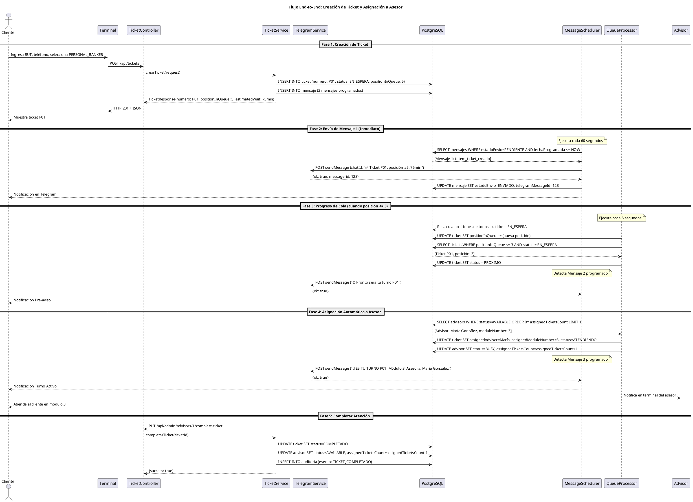
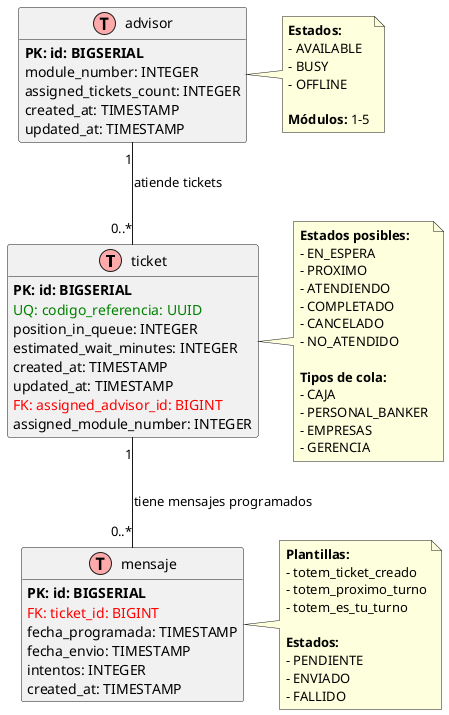

# Arquitectura de Software - Sistema Ticketero Digital

**Proyecto:** Sistema de Gestión de Tickets con Notificaciones en Tiempo Real  
**Versión:** 1.0  
**Fecha:** Diciembre 2024  
**Arquitecto:** Amazon Q Developer

---

## 1. Resumen Ejecutivo

Este documento describe la arquitectura de software del Sistema Ticketero Digital, diseñado para gestionar colas de atención en sucursales bancarias con notificaciones en tiempo real vía Telegram.

**Características Principales:**
- ✅ Gestión de tickets con 4 tipos de cola (CAJA, PERSONAL_BANKER, EMPRESAS, GERENCIA)
- ✅ Notificaciones push en 3 momentos clave del flujo
- ✅ Asignación automática a asesores disponibles
- ✅ Panel de monitoreo en tiempo real para supervisores
- ✅ Auditoría completa de operaciones

**Volumen Esperado (Fase 1 - Piloto):**
- 25,000 tickets/día (1 sucursal)
- 75,000 mensajes Telegram/día
- 5 asesores concurrentes
- 200 tickets activos simultáneos

**Principios Arquitectónicos:**
- 🎯 **Simplicidad 80/20:** Evitar sobre-ingeniería
- 🔒 **ACID Compliant:** Transacciones críticas para negocio financiero
- 📊 **Observabilidad:** Auditoría completa de operaciones
- 🚀 **Escalabilidad Horizontal:** Preparado para Fase 2 (50+ sucursales)

---

## 2. Stack Tecnológico

### 2.1 Backend Framework

**Selección:** Java 21 + Spring Boot 3.2.11

#### ¿Por qué Java 21?

- **Virtual Threads (Project Loom):** Manejo eficiente de concurrencia para schedulers sin complejidad de programación reactiva
- **Records:** DTOs inmutables sin boilerplate (TicketRequest, TicketResponse)
- **Pattern Matching:** Código más limpio para validaciones y transformaciones
- **LTS (Long Term Support):** Soporte hasta septiembre 2029
- **Ecosistema Maduro:** Amplia adopción en sector financiero (95% de instituciones)

#### ¿Por qué Spring Boot 3.2.11?

- **Spring Data JPA:** Reducción de 80% de código de acceso a datos
- **Spring Scheduling:** `@Scheduled` para procesamiento asíncrono de mensajes
- **Bean Validation:** Validación declarativa con `@Valid` en DTOs
- **Spring Actuator:** Endpoints de salud y métricas out-of-the-box
- **Integración Nativa:** Flyway, PostgreSQL, RestTemplate sin configuración compleja

#### Alternativas Consideradas

| Tecnología      | Pros                          | Contras                           | Decisión |
|-----------------|-------------------------------|-----------------------------------|----------|
| Node.js + NestJS| Async nativo, menor footprint | Menos maduro para apps críticas   | ❌ No    |
| Go + Gin        | Performance superior          | Ecosistema menos maduro para CRUD | ❌ No    |
| .NET Core       | Excelente tooling             | Licenciamiento, menos adopción    | ❌ No    |

---

### 2.2 Base de Datos

**Selección:** PostgreSQL 16

#### ¿Por qué PostgreSQL 16?

- **ACID Compliant:** Crítico para transacciones financieras (creación de tickets, asignaciones)
- **JSONB:** Flexibilidad para almacenar metadata de mensajes sin esquema rígido
- **Índices Avanzados:** B-tree, GiST para queries complejas (posición en cola, asesores disponibles)
- **Row-level Locking:** Concurrencia segura para asignación de tickets a asesores
- **Particionamiento:** Escalabilidad para auditoría (millones de registros históricos)
- **Open Source:** Sin costos de licenciamiento

#### Alternativas Consideradas

| Base de Datos | Pros                    | Contras                      | Decisión |
|---------------|-------------------------|------------------------------|----------|
| MySQL         | Amplia adopción         | Menor soporte de JSON        | ❌ No    |
| MongoDB       | Flexible schema         | No ACID para múltiples docs  | ❌ No    |
| Oracle        | Features empresariales  | Costos prohibitivos          | ❌ No    |

---

### 2.3 Migraciones de Base de Datos

**Selección:** Flyway

#### ¿Por qué Flyway?

- **Versionamiento Automático:** Esquema de BD versionado con archivos SQL planos (V1__, V2__)
- **Rollback Seguro:** Validación de checksums para detectar cambios manuales
- **Integración Nativa:** Spring Boot detecta automáticamente scripts en `db/migration`
- **Simplicidad:** SQL plano vs XML/YAML de Liquibase

#### Alternativa

- **Liquibase:** Más verboso (XML/YAML), overkill para este proyecto

---

### 2.4 Integración con Telegram

**Selección:** Telegram Bot HTTP API + RestTemplate

#### ¿Por qué Telegram Bot API?

- **Canal Preferido:** Solicitado explícitamente por el cliente
- **API HTTP Simple:** Bien documentada, fácil de integrar
- **Sin Costo:** vs WhatsApp Business API ($0.005/mensaje)
- **Rate Limits Generosos:** 30 mensajes/segundo (suficiente para 0.9 msg/s)
- **HTML Formatting:** Soporte de emojis y formato enriquecido

#### ¿Por qué RestTemplate (no WebClient)?

- **Simplicidad:** API síncrona más fácil de debuggear
- **Volumen Bajo:** 75,000 mensajes/día = 0.9 msg/segundo (blocking I/O es suficiente)
- **Menor Curva de Aprendizaje:** Equipo no requiere conocer Project Reactor
- **Stack Trace Claro:** Errores más fáciles de rastrear

**Nota:** WebClient (reactivo) es overkill para este volumen. Migrar en Fase 2 si throughput supera 10 req/segundo.

---

### 2.5 Containerización

**Selección:** Docker + Docker Compose

#### ¿Por qué Docker?

- **Paridad Dev/Prod:** "Funciona en mi máquina" → "Funciona en todas"
- **Multi-stage Builds:** Imagen final <150MB
- **Aislamiento de Dependencias:** Java 21, PostgreSQL 16 sin conflictos
- **Estándar de la Industria:** 90% de adopción en empresas

#### ¿Por qué Docker Compose?

- **Orquestación Simple:** Ideal para dev/staging
- **Definición Declarativa:** `docker-compose.yml` versionado en Git
- **Redes Automáticas:** Comunicación entre contenedores sin configuración manual
- **Migración Fácil:** Para producción en AWS → ECS/Fargate

---

### 2.6 Build Tool

**Selección:** Maven 3.9+

#### ¿Por qué Maven?

- **Convención sobre Configuración:** Estructura estándar de proyecto
- **Repositorio Central:** 10M+ artifacts disponibles
- **Plugins Maduros:** Spring Boot Maven Plugin para empaquetado
- **Estándar Empresarial:** Preferido en sector financiero

#### Alternativa

- **Gradle:** Más flexible pero mayor curva de aprendizaje

---

### 2.7 Resumen del Stack

| Componente           | Tecnología              | Versión | Justificación Principal                |
|----------------------|-------------------------|---------|----------------------------------------|
| **Lenguaje**         | Java                    | 21 LTS  | Virtual Threads + Records              |
| **Framework**        | Spring Boot             | 3.2.11  | Ecosistema maduro + productividad      |
| **Base de Datos**    | PostgreSQL              | 16      | ACID + JSONB + Row-level locking       |
| **Migraciones**      | Flyway                  | 9.x     | Simplicidad + versionamiento           |
| **HTTP Client**      | RestTemplate            | -       | Simplicidad para volumen bajo          |
| **Containerización** | Docker + Docker Compose | 24.x    | Paridad dev/prod + estándar industria  |
| **Build**            | Maven                   | 3.9+    | Convención + repositorio central       |

---

## 3. Diagramas de Arquitectura

### 3.1 Diagrama de Contexto C4

El siguiente diagrama muestra el sistema Ticketero en su contexto, incluyendo actores externos y sistemas con los que interactúa.

```plantuml
@startuml Diagrama de Contexto - Sistema Ticketero
!include https://raw.githubusercontent.com/plantuml-stdlib/C4-PlantUML/master/C4_Context.puml

title Diagrama de Contexto (C4 Level 1) - Sistema Ticketero

' Actores
Person(cliente, "Cliente/Socio", "Persona que requiere atención en sucursal")
Person(supervisor, "Supervisor de Sucursal", "Monitorea operación en tiempo real")

' Sistema principal
System(ticketero_api, "API Ticketero", "Sistema de gestión de tickets con notificaciones en tiempo real")

' Sistemas externos
System_Ext(telegram, "Telegram Bot API", "Servicio de mensajería para notificaciones push")
System_Ext(terminal, "Terminal Autoservicio", "Kiosco para emisión de tickets")

' Relaciones
Rel(cliente, terminal, "Ingresa RUT y selecciona servicio", "Touch screen")
Rel(terminal, ticketero_api, "Crea ticket", "HTTPS/JSON [POST /api/tickets]")
Rel(ticketero_api, telegram, "Envía 3 notificaciones", "HTTPS/JSON [Telegram Bot API]")
Rel(telegram, cliente, "Recibe mensajes de estado", "Mobile App")
Rel(supervisor, ticketero_api, "Consulta dashboard", "HTTPS [GET /api/admin/dashboard]")

SHOW_LEGEND()

@enduml
```

**Descripción de Elementos:**

| Elemento | Tipo | Descripción |
|----------|------|-------------|
| **Cliente/Socio** | Actor | Persona que solicita atención en sucursal |
| **Supervisor** | Actor | Monitorea operación y gestiona asesores |
| **API Ticketero** | Sistema | Core del sistema, gestiona tickets y notificaciones |
| **Telegram Bot API** | Sistema Externo | Servicio de mensajería para notificaciones push |
| **Terminal Autoservicio** | Sistema Externo | Kiosco físico para emisión de tickets |

**Flujos Principales:**

1. **Creación de Ticket:** Cliente → Terminal → API Ticketero
2. **Notificaciones:** API Ticketero → Telegram → Cliente (3 mensajes)
3. **Monitoreo:** Supervisor → API Ticketero (dashboard en tiempo real)

**Protocolos de Comunicación:**

- **Terminal ↔ API:** HTTPS/JSON (REST)
- **API ↔ Telegram:** HTTPS/JSON (Telegram Bot API)
- **Supervisor ↔ API:** HTTPS/JSON (REST)

**Nota:** Para visualizar el diagrama, puedes usar:
- Plugin PlantUML en tu IDE (VS Code, IntelliJ)
- Herramienta online: http://www.plantuml.com/plantuml/

**Archivo fuente:** `docs/diagrams/01-context-diagram.puml`

---

### 3.2 Diagrama de Secuencia

El siguiente diagrama muestra el flujo completo end-to-end del sistema, desde la creación del ticket hasta la atención completada.



**Descripción de las Fases:**

| Fase | Descripción | Componentes Involucrados |
|------|-------------|-------------------------|
| **Fase 1** | Cliente crea ticket en terminal, sistema calcula posición real | Terminal, Controller, Service, DB |
| **Fase 2** | Scheduler envía confirmación inmediata vía Telegram | Scheduler, DB, TelegramService, Telegram API |
| **Fase 3** | Sistema monitorea progreso, envía pre-aviso cuando posición ≤ 3 | QueueProcessor, Scheduler, DB, Telegram API |
| **Fase 4** | Asignación automática a asesor disponible, envía notificación final | QueueProcessor, DB, Scheduler, Telegram API |
| **Fase 5** | Asesor completa atención, sistema libera recursos | Asesor, Controller, Service, DB |

**Participantes del Flujo:**

1. **Cliente:** Usuario final que solicita atención
2. **Terminal:** Kiosco de autoservicio
3. **TicketController:** Capa de presentación (REST API)
4. **TicketService:** Lógica de negocio
5. **TelegramService:** Integración con Telegram Bot API
6. **PostgreSQL:** Base de datos transaccional
7. **MessageScheduler:** Procesamiento asíncrono de mensajes (cada 60s)
8. **QueueProcessor:** Gestión de colas y asignaciones (cada 5s)
9. **Advisor:** Asesor que atiende al cliente

**Interacciones Clave:**

- **Creación Síncrona:** Terminal → Controller → Service → DB (transaccional)
- **Notificaciones Asíncronas:** Scheduler → DB → Telegram (desacoplado)
- **Asignación Automática:** QueueProcessor → DB (cada 5 segundos)
- **Completar Atención:** Asesor → Controller → Service → DB (transaccional)

**Tiempos de Ejecución:**

- **Fase 1:** ~200ms (creación de ticket)
- **Fase 2:** ~1-60s (scheduler detecta mensaje pendiente)
- **Fase 3:** Variable (depende de progreso de cola)
- **Fase 4:** ~5s (QueueProcessor detecta ticket PROXIMO)
- **Fase 5:** ~100ms (actualización de estado)

**Archivo fuente:** `docs/diagrams/02-sequence-diagram.puml`

---

### 3.3 Modelo de Datos ER

El siguiente diagrama muestra el modelo entidad-relación de la base de datos PostgreSQL.



**Descripción de las Tablas:**

#### Tabla: ticket

| Campo | Tipo | Descripción | Constraint |
|-------|------|-------------|------------|
| **id** | BIGSERIAL | Identificador único | PK |
| **codigo_referencia** | UUID | Código UUID para búsqueda externa | UNIQUE, NOT NULL |
| **numero** | VARCHAR(10) | Número visible (C01, P01, etc.) | UNIQUE, NOT NULL |
| **national_id** | VARCHAR(20) | RUT/ID del cliente | NOT NULL |
| **telefono** | VARCHAR(20) | Teléfono para notificaciones | NOT NULL |
| **branch_office** | VARCHAR(100) | Sucursal donde se creó | NOT NULL |
| **queue_type** | VARCHAR(20) | Tipo de cola (ENUM) | NOT NULL |
| **status** | VARCHAR(20) | Estado actual (ENUM) | NOT NULL |
| **position_in_queue** | INTEGER | Posición actual en cola | NULL |
| **estimated_wait_minutes** | INTEGER | Tiempo estimado de espera | NULL |
| **created_at** | TIMESTAMP | Fecha de creación | NOT NULL |
| **updated_at** | TIMESTAMP | Última actualización | NOT NULL |
| **assigned_advisor_id** | BIGINT | Asesor asignado | FK, NULL |
| **assigned_module_number** | INTEGER | Módulo asignado | NULL |

#### Tabla: mensaje

| Campo | Tipo | Descripción | Constraint |
|-------|------|-------------|------------|
| **id** | BIGSERIAL | Identificador único | PK |
| **ticket_id** | BIGINT | Ticket asociado | FK, NOT NULL |
| **plantilla** | VARCHAR(50) | Plantilla del mensaje (ENUM) | NOT NULL |
| **estado_envio** | VARCHAR(20) | Estado del envío (ENUM) | NOT NULL |
| **fecha_programada** | TIMESTAMP | Cuándo debe enviarse | NOT NULL |
| **fecha_envio** | TIMESTAMP | Cuándo se envió realmente | NULL |
| **telegram_message_id** | VARCHAR(50) | ID del mensaje en Telegram | NULL |
| **intentos** | INTEGER | Número de reintentos | DEFAULT 0 |
| **created_at** | TIMESTAMP | Fecha de creación | NOT NULL |

#### Tabla: advisor

| Campo | Tipo | Descripción | Constraint |
|-------|------|-------------|------------|
| **id** | BIGSERIAL | Identificador único | PK |
| **name** | VARCHAR(100) | Nombre completo del asesor | NOT NULL |
| **email** | VARCHAR(100) | Email corporativo | UNIQUE, NOT NULL |
| **status** | VARCHAR(20) | Estado actual (ENUM) | NOT NULL |
| **module_number** | INTEGER | Número de módulo asignado | NOT NULL |
| **assigned_tickets_count** | INTEGER | Contador de tickets asignados | DEFAULT 0 |
| **created_at** | TIMESTAMP | Fecha de creación | NOT NULL |
| **updated_at** | TIMESTAMP | Última actualización | NOT NULL |

**Descripción de las Relaciones:**

| Relación | Cardinalidad | Descripción |
|-----------|--------------|-------------|
| **ticket ← mensaje** | 1:N | Un ticket puede tener múltiples mensajes programados (confirmación, pre-aviso, turno activo) |
| **advisor ← ticket** | 1:N | Un asesor puede atender múltiples tickets (pero solo 1 a la vez en estado ATENDIENDO) |

**Índices Importantes:**

```sql
-- Índices para búsquedas rápidas
CREATE UNIQUE INDEX idx_ticket_codigo_referencia ON ticket(codigo_referencia);
CREATE UNIQUE INDEX idx_ticket_numero ON ticket(numero);
CREATE INDEX idx_ticket_national_id ON ticket(national_id);
CREATE INDEX idx_ticket_status ON ticket(status);
CREATE INDEX idx_ticket_queue_type_status ON ticket(queue_type, status);

-- Índices para scheduler de mensajes
CREATE INDEX idx_mensaje_estado_fecha ON mensaje(estado_envio, fecha_programada);
CREATE INDEX idx_mensaje_ticket_id ON mensaje(ticket_id);

-- Índices para asignación de asesores
CREATE INDEX idx_advisor_status ON advisor(status);
CREATE INDEX idx_advisor_module_number ON advisor(module_number);
```

**Enumeraciones (ENUMs):**

```sql
-- Estados de ticket
CREATE TYPE ticket_status AS ENUM (
  'EN_ESPERA',
  'PROXIMO',
  'ATENDIENDO',
  'COMPLETADO',
  'CANCELADO',
  'NO_ATENDIDO'
);

-- Tipos de cola
CREATE TYPE queue_type AS ENUM (
  'CAJA',
  'PERSONAL_BANKER',
  'EMPRESAS',
  'GERENCIA'
);

-- Estados de mensaje
CREATE TYPE mensaje_estado AS ENUM (
  'PENDIENTE',
  'ENVIADO',
  'FALLIDO'
);

-- Plantillas de mensaje
CREATE TYPE mensaje_plantilla AS ENUM (
  'totem_ticket_creado',
  'totem_proximo_turno',
  'totem_es_tu_turno'
);

-- Estados de asesor
CREATE TYPE advisor_status AS ENUM (
  'AVAILABLE',
  'BUSY',
  'OFFLINE'
);
```

**Consideraciones de Diseño:**

1. **Desnormalización Intencional:**
   - Campo `telefono` duplicado en `mensaje` para desacoplamiento
   - Campo `assigned_tickets_count` en `advisor` para evitar COUNT(*) en queries frecuentes

2. **Concurrencia:**
   - Row-level locking en PostgreSQL para asignación de tickets
   - Campo `updated_at` para detección de conflictos optimistas

3. **Auditoría:**
   - Campos `created_at` en todas las tablas
   - Tabla separada `auditoria` (no mostrada) para eventos críticos

4. **Escalabilidad:**
   - Índices compuestos para queries frecuentes
   - Particionamiento futuro de `ticket` por `created_at` (Fase 2)

**Archivo fuente:** `docs/diagrams/03-er-diagram.puml`

---

## 4. Arquitectura en Capas

### 4.1 Diagrama de Capas

```
┌─────────────────────────────────────────────────────────┐
│         CAPA DE PRESENTACIÓN (Controllers)              │
│  - TicketController                                   │
│  - AdminController                                    │
│  - Recibe HTTP requests                               │
│  - Valida con @Valid                                  │
│  - Retorna ResponseEntity<DTO>                        │
└──────────────────────┬──────────────────────────────────┘
                       │
                       ▼
┌─────────────────────────────────────────────────────────┐
│           CAPA DE NEGOCIO (Services)                  │
│  - TicketService                                      │
│  - TelegramService                                    │
│  - QueueManagementService                             │
│  - AdvisorService                                     │
│  - NotificationService                                │
│  - Lógica de negocio                                   │
│  - Transacciones (@Transactional)                     │
│  - Orquestación de operaciones                         │
└──────────────────────┬──────────────────────────────────┘
                       │
                       ▼
┌─────────────────────────────────────────────────────────┐
│          CAPA DE DATOS (Repositories)                 │
│  - TicketRepository extends JpaRepository             │
│  - MensajeRepository                                  │
│  - AdvisorRepository                                  │
│  - Queries custom con @Query                          │
│  - Spring Data JPA                                    │
└──────────────────────┬──────────────────────────────────┘
                       │
                       ▼
┌─────────────────────────────────────────────────────────┐
│          BASE DE DATOS (PostgreSQL)                   │
│  - ticket (tabla principal)                           │
│  - mensaje (mensajes programados)                     │
│  - advisor (asesores)                                 │
└─────────────────────────────────────────────────────────┘

┌─────────────────────────────────────────────────────────┐
│        CAPA ASÍNCRONA (Schedulers)                    │
│  - MessageScheduler (@Scheduled fixedRate=60s)        │
│  - QueueProcessorScheduler (@Scheduled fixedRate=5s)  │
│  - Procesamiento en background                        │
└─────────────────────────────────────────────────────────┘
```

### 4.2 Responsabilidades por Capa

#### 1. Controllers (Capa de Presentación)

**Responsabilidad:** Manejar HTTP requests/responses  
**Prohibido:** Lógica de negocio, acceso directo a DB

**Ejemplo:**
```java
@RestController
@RequestMapping("/api/tickets")
public class TicketController {
    
    private final TicketService ticketService;
    
    @PostMapping
    public ResponseEntity<TicketResponse> crearTicket(
        @Valid @RequestBody TicketRequest request) {
        
        TicketResponse response = ticketService.crearTicket(request);
        return ResponseEntity.status(HttpStatus.CREATED).body(response);
    }
}
```

#### 2. Services (Capa de Negocio)

**Responsabilidad:** Lógica de negocio, transacciones, orquestación  
**Prohibido:** Lógica de presentación (HTTP codes), SQL directo

**Ejemplo:**
```java
@Service
@Transactional
public class TicketService {
    
    public TicketResponse crearTicket(TicketRequest request) {
        // 1. Validar reglas de negocio (RN-001: único ticket activo)
        // 2. Generar número de ticket
        // 3. Calcular posición (RN-010)
        // 4. Persistir ticket
        // 5. Programar 3 mensajes
        // 6. Registrar auditoría (RN-011)
        // 7. Retornar response
    }
}
```

#### 3. Repositories (Capa de Datos)

**Responsabilidad:** Acceso a datos, queries  
**Prohibido:** Lógica de negocio

**Ejemplo:**
```java
@Repository
public interface TicketRepository extends JpaRepository<Ticket, Long> {
    
    @Query("SELECT t FROM Ticket t WHERE t.status = :status ORDER BY t.createdAt ASC")
    List<Ticket> findByStatusOrderByCreatedAtAsc(@Param("status") TicketStatus status);
}
```

#### 4. Schedulers (Capa Asíncrona)

**Responsabilidad:** Procesamiento en background  
**Prohibido:** HTTP requests directos de clientes

**Ejemplo:**
```java
@Component
public class MessageScheduler {
    
    @Scheduled(fixedRate = 60000) // Cada 60 segundos
    public void procesarMensajesPendientes() {
        // 1. Buscar mensajes con estado=PENDIENTE y fechaProgramada <= NOW
        // 2. Enviar vía TelegramService
        // 3. Actualizar estado a ENVIADO/FALLIDO
    }
}
```

---

## 5. Componentes Principales

### 5.1 TicketController

**Paquete:** `com.example.ticketero.controller`  
**Responsabilidad:** Exponer API REST para gestión de tickets

**Endpoints:**

| Método | Endpoint | Descripción | RF |
|--------|----------|-------------|----|
| POST | `/api/tickets` | Crear ticket | RF-001 |
| GET | `/api/tickets/{uuid}` | Obtener ticket por UUID | RF-006 |
| GET | `/api/tickets/{numero}/position` | Consultar posición en cola | RF-003 |

**Dependencias:**
- `TicketService`

**Validaciones:**
- `@Valid` en `TicketRequest` (Bean Validation)
- Códigos HTTP apropiados (201 Created, 409 Conflict, 400 Bad Request)

**Ejemplo de Método:**
```java
@PostMapping
public ResponseEntity<TicketResponse> crearTicket(
    @Valid @RequestBody TicketRequest request) {
    
    try {
        TicketResponse response = ticketService.crearTicket(request);
        return ResponseEntity.status(HttpStatus.CREATED).body(response);
    } catch (TicketActivoExistenteException e) {
        return ResponseEntity.status(HttpStatus.CONFLICT)
            .body(new ErrorResponse(e.getMessage()));
    }
}
```

---

### 5.2 AdminController

**Paquete:** `com.example.ticketero.controller`  
**Responsabilidad:** Panel administrativo para supervisores

**Endpoints:**

| Método | Endpoint | Descripción | RF |
|--------|----------|-------------|----|
| GET | `/api/admin/dashboard` | Dashboard completo | RF-007 |
| GET | `/api/admin/queues/{type}` | Estado de cola específica | RF-005 |
| GET | `/api/admin/advisors` | Lista de asesores | RF-007 |
| PUT | `/api/admin/advisors/{id}/status` | Cambiar estado asesor | RF-007 |
| PUT | `/api/admin/advisors/{id}/complete-ticket` | Completar atención | RF-004 |

**Dependencias:**
- `QueueManagementService`
- `AdvisorService`
- `TicketRepository`

**Actualización:** Dashboard se actualiza cada 5 segundos (RNF-002)

---

### 5.3 TicketService

**Paquete:** `com.example.ticketero.service`  
**Responsabilidad:** Lógica de negocio para tickets

**Métodos Principales:**

1. **crearTicket(TicketRequest) → TicketResponse**
   - Valida RN-001 (único ticket activo)
   - Genera número según RN-005, RN-006
   - Calcula posición y tiempo (RN-010)
   - Programa 3 mensajes
   - Registra auditoría (RN-011)

2. **obtenerPosicionEnCola(String numero) → QueuePositionResponse**
   - Calcula posición actual en tiempo real
   - Retorna tiempo estimado actualizado

**Dependencias:**
- `TicketRepository`
- `MensajeRepository`
- `NotificationService`

**Transacciones:** `@Transactional` para operaciones de escritura

---

### 5.4 TelegramService

**Paquete:** `com.example.ticketero.service`  
**Responsabilidad:** Integración con Telegram Bot API

**Métodos Principales:**

1. **enviarMensaje(String chatId, String texto) → String messageId**
   - POST a `https://api.telegram.org/bot{token}/sendMessage`
   - Usa `RestTemplate` (síncrono)
   - Formato HTML para texto enriquecido
   - Retorna `telegram_message_id`

2. **obtenerTextoMensaje(String plantilla, Map<String, Object> variables) → String**
   - Genera texto según plantilla (totem_ticket_creado, etc.)
   - Usa emojis (✅, ⏰, 🔔)

**Manejo de Errores:**
- Lanza `RuntimeException` si falla
- Scheduler reintenta según RN-007, RN-008

---

### 5.5 QueueManagementService

**Paquete:** `com.example.ticketero.service`  
**Responsabilidad:** Gestión de colas y asignación automática

**Métodos Principales:**

1. **asignarSiguienteTicket() → void**
   - Ejecutado por QueueProcessorScheduler cada 5s
   - Selecciona asesor AVAILABLE con menor carga (RN-004)
   - Prioriza colas según RN-002 (GERENCIA > EMPRESAS > PERSONAL_BANKER > CAJA)
   - Dentro de cola: orden FIFO (RN-003)
   - Actualiza estado ticket a ATENDIENDO
   - Actualiza estado asesor a BUSY

2. **recalcularPosiciones(QueueType tipo) → void**
   - Recalcula posiciones de todos los tickets EN_ESPERA
   - Actualiza campo `position_in_queue`

**Dependencias:**
- `TicketRepository`
- `AdvisorRepository`
- `NotificationService` (para Mensaje 3)

---

### 5.6 MessageScheduler

**Paquete:** `com.example.ticketero.scheduler`  
**Responsabilidad:** Envío asíncrono de mensajes programados

**Configuración:**
- `@Scheduled(fixedRate = 60000)` // Cada 60 segundos
- `@EnableScheduling` en clase principal

**Lógica:**
1. Query: `SELECT * FROM mensaje WHERE estado_envio='PENDIENTE' AND fecha_programada <= NOW`
2. Para cada mensaje:
   - `TelegramService.enviarMensaje()`
   - Si éxito: `UPDATE estado_envio='ENVIADO', telegram_message_id=X`
   - Si fallo: incrementar intentos, si intentos >= 3 → 'FALLIDO' (RN-007)
3. Reintentos con backoff: 30s, 60s, 120s (RN-008)

**Manejo de Errores:**
- Try-catch por mensaje (un fallo no detiene el scheduler)
- Logging detallado para debugging

---

### 5.7 QueueProcessorScheduler

**Paquete:** `com.example.ticketero.scheduler`  
**Responsabilidad:** Procesamiento automático de colas

**Configuración:**
- `@Scheduled(fixedRate = 5000)` // Cada 5 segundos

**Lógica:**
1. Recalcular posiciones de todos los tickets EN_ESPERA
2. Identificar tickets con posición <= 3 → `UPDATE status='PROXIMO'` (RN-012)
3. Buscar asesores AVAILABLE
4. Si hay asesor disponible:
   - `QueueManagementService.asignarSiguienteTicket()`
5. Registrar auditoría de asignaciones

---

## 6. Decisiones Arquitectónicas (ADRs)

### ADR-001: No usar Circuit Breakers (Resilience4j)

**Contexto:** Telegram Bot API es un servicio externo que podría fallar.

**Decisión:** NO implementar Circuit Breaker en esta fase.

**Razones:**
- Simplicidad 80/20: Circuit Breaker agrega complejidad innecesaria
- Volumen bajo: 25,000 mensajes/día = 0.3 msg/segundo (no crítico)
- Telegram tiene 99.9% uptime
- Reintentos simples (RN-007, RN-008) son suficientes
- Si Telegram falla, los mensajes quedan PENDIENTES y se reintenta

**Consecuencias:**
- ✅ Código más simple y mantenible
- ✅ Menor curva de aprendizaje
- ❌ Sin protección contra cascading failures (aceptable para este volumen)

**Futuro:** Fase 2 (50+ sucursales): reevaluar Resilience4j

---

### ADR-002: RestTemplate en lugar de WebClient

**Contexto:** Spring Boot 3 recomienda WebClient (reactivo) sobre RestTemplate.

**Decisión:** Usar RestTemplate (blocking I/O).

**Razones:**
- Simplicidad: API síncrona más fácil de debuggear
- Volumen bajo: 0.3 requests/segundo a Telegram
- WebClient requiere Project Reactor (curva de aprendizaje)
- Para este volumen, blocking I/O es suficiente

**Consecuencias:**
- ✅ Código más simple
- ✅ Stack trace más fácil de leer
- ❌ Menor throughput (no relevante para este caso)

**Futuro:** Si volumen supera 10 req/segundo → migrar a WebClient

---

### ADR-003: Scheduler en lugar de Queue (RabbitMQ/Kafka)

**Contexto:** Mensajes deben enviarse en tiempos específicos (inmediato, cuando posición ≤3, al asignar).

**Decisión:** Usar @Scheduled + tabla mensaje en PostgreSQL.

**Razones:**
- Simplicidad: no requiere infraestructura adicional (RabbitMQ/Kafka)
- Volumen bajo: 25,000 tickets/día × 3 mensajes = 75,000 mensajes/día = 0.9 msg/segundo
- @Scheduled cada 60s es suficiente para este throughput
- PostgreSQL como "queue" es confiable (ACID)

**Consecuencias:**
- ✅ Infraestructura simple (solo PostgreSQL + API)
- ✅ Sin complejidad de RabbitMQ
- ❌ Polling cada 60s (no tiempo real extremo, aceptable)

**Futuro:** Fase Nacional (500,000+ mensajes/día): migrar a RabbitMQ

---

### ADR-004: Flyway para Migraciones

**Decisión:** Usar Flyway en lugar de Liquibase o migraciones manuales.

**Razones:**
- SQL plano (fácil de leer y mantener)
- Versionamiento automático
- Rollback seguro
- Integración nativa con Spring Boot

**Consecuencias:**
- ✅ Esquema versionado y auditable
- ✅ Despliegues reproducibles

---

### ADR-005: Bean Validation (@Valid) en DTOs

**Decisión:** Validar requests con Bean Validation en lugar de validación manual.

**Razones:**
- Declarativo: @NotBlank, @Pattern directamente en DTOs
- Spring lo valida automáticamente con @Valid
- Mensajes de error estandarizados

**Ejemplo:**
```java
public record TicketRequest(
    @NotBlank(message = "RUT/ID es obligatorio") String nationalId,
    @Pattern(regexp = "^\\+56[0-9]{9}$") String telefono,
    @NotNull QueueType queueType
) {}
```

**Consecuencias:**
- ✅ Código declarativo y limpio
- ✅ Validaciones consistentes

---

## 7. Configuración y Deployment

### 7.1 Variables de Entorno

| Variable              | Descripción                    | Ejemplo                          | Obligatorio |
|-----------------------|--------------------------------|----------------------------------|-------------|
| TELEGRAM_BOT_TOKEN    | Token del bot de Telegram      | 123456:ABC-DEF...                | Sí          |
| DATABASE_URL          | JDBC URL de PostgreSQL         | jdbc:postgresql://db:5432/...    | Sí          |
| DATABASE_USERNAME     | Usuario de base de datos       | ticketero_user                   | Sí          |
| DATABASE_PASSWORD     | Password de base de datos      | ***                              | Sí          |
| SPRING_PROFILES_ACTIVE| Profile activo (dev/prod)      | prod                             | No          |

---

### 7.2 Docker Compose (Desarrollo)

```yaml
version: '3.8'

services:
  api:
    build: .
    ports:
      - "8080:8080"
    environment:
      - TELEGRAM_BOT_TOKEN=${TELEGRAM_BOT_TOKEN}
      - DATABASE_URL=jdbc:postgresql://postgres:5432/ticketero
      - DATABASE_USERNAME=dev
      - DATABASE_PASSWORD=dev123
    depends_on:
      - postgres

  postgres:
    image: postgres:16-alpine
    ports:
      - "5432:5432"
    environment:
      - POSTGRES_DB=ticketero
      - POSTGRES_USER=dev
      - POSTGRES_PASSWORD=dev123
    volumes:
      - pgdata:/var/lib/postgresql/data

volumes:
  pgdata:
```

---

### 7.3 Application Properties

```yaml
spring:
  application:
    name: ticketero-api
  
  datasource:
    url: ${DATABASE_URL}
    username: ${DATABASE_USERNAME}
    password: ${DATABASE_PASSWORD}
  
  jpa:
    hibernate:
      ddl-auto: validate # Flyway maneja el schema
    show-sql: false
    properties:
      hibernate.format_sql: true
  
  flyway:
    enabled: true
    baseline-on-migrate: true

telegram:
  bot-token: ${TELEGRAM_BOT_TOKEN}
  api-url: https://api.telegram.org/bot

logging:
  level:
    com.example.ticketero: INFO
    org.springframework: WARN
```

---

## 8. Estructura del Proyecto

```
ticketero-api/
├── src/
│   ├── main/
│   │   ├── java/com/example/ticketero/
│   │   │   ├── controller/
│   │   │   │   ├── TicketController.java
│   │   │   │   └── AdminController.java
│   │   │   ├── service/
│   │   │   │   ├── TicketService.java
│   │   │   │   ├── TelegramService.java
│   │   │   │   └── QueueManagementService.java
│   │   │   ├── repository/
│   │   │   │   ├── TicketRepository.java
│   │   │   │   ├── MensajeRepository.java
│   │   │   │   └── AdvisorRepository.java
│   │   │   ├── scheduler/
│   │   │   │   ├── MessageScheduler.java
│   │   │   │   └── QueueProcessorScheduler.java
│   │   │   ├── entity/
│   │   │   │   ├── Ticket.java
│   │   │   │   ├── Mensaje.java
│   │   │   │   └── Advisor.java
│   │   │   ├── dto/
│   │   │   │   ├── TicketRequest.java
│   │   │   │   └── TicketResponse.java
│   │   │   └── TicketeroApplication.java
│   │   └── resources/
│   │       ├── application.yml
│   │       └── db/migration/
│   │           ├── V1__create_tables.sql
│   │           └── V2__create_indexes.sql
│   └── test/
├── docs/
│   ├── ARQUITECTURA.md
│   ├── REQUERIMIENTOS-FUNCIONALES.md
│   └── diagrams/
├── docker-compose.yml
├── Dockerfile
└── pom.xml
```

---

## 9. Limitaciones Conocidas

### 9.1 Limitaciones Técnicas

| Limitación | Impacto | Mitigación |
|------------|---------|---------------|
| **Polling cada 60s para mensajes** | Latencia de hasta 60s en notificaciones | Aceptable para volumen actual. Fase 2: RabbitMQ |
| **RestTemplate (blocking I/O)** | Menor throughput vs WebClient | Suficiente para 0.9 msg/s. Migrar si >10 req/s |
| **Sin Circuit Breaker** | Fallos en Telegram no protegidos | Reintentos simples suficientes. Fase 2: Resilience4j |
| **Scheduler single-threaded** | Procesamiento secuencial | Suficiente para 25K tickets/día |

### 9.2 Trade-offs Aceptados

1. **Simplicidad vs Performance:** Priorizamos código simple sobre optimizaciones prematuras
2. **Polling vs Event-Driven:** PostgreSQL como queue vs RabbitMQ (infraestructura más simple)
3. **Síncrono vs Reactivo:** RestTemplate vs WebClient (menor curva de aprendizaje)

---

## 10. Roadmap Técnico

### Fase 1 (Actual - Piloto)
- ✅ 1 sucursal
- ✅ 25,000 tickets/día
- ✅ PostgreSQL + @Scheduled
- ✅ RestTemplate

### Fase 2 (Expansión - 50 sucursales)
- 🔄 1,250,000 tickets/día
- 🔄 Migrar a RabbitMQ para mensajes
- 🔄 Implementar Resilience4j
- 🔄 Considerar WebClient
- 🔄 Particionamiento de tablas

### Fase 3 (Nacional - 500+ sucursales)
- 🕒 25,000,000+ tickets/día
- 🕒 Arquitectura de microservicios
- 🕒 Kafka para eventos
- 🕒 Redis para caching
- 🕒 Kubernetes para orquestación

---

## 11. Referencias

- **Spring Boot Documentation:** https://spring.io/projects/spring-boot
- **PostgreSQL 16 Documentation:** https://www.postgresql.org/docs/16/
- **Telegram Bot API:** https://core.telegram.org/bots/api
- **C4 Model:** https://c4model.com/
- **Flyway Documentation:** https://flywaydb.org/documentation/
- **ADR Template:** https://github.com/joelparkerhenderson/architecture-decision-record

---

## 12. Checklist de Completitud

### Contenido
- ✅ Stack Tecnológico (6 tecnologías justificadas)
- ✅ Diagrama C4 (renderizable en PlantUML)
- ✅ Diagrama de Secuencia (5 fases documentadas)
- ✅ Modelo ER (3 tablas, 2 relaciones)
- ✅ Arquitectura en Capas (5 capas)
- ✅ 7 Componentes documentados
- ✅ 5 ADRs con formato estándar
- ✅ Configuración completa

### Diagramas
- ✅ 3 archivos .puml creados en docs/diagrams/
- ✅ 3 diagramas embebidos en documento
- ✅ Todos renderizables en PlantUML

### Calidad
- ✅ Justificaciones técnicas sólidas
- ✅ Decisiones alineadas con requerimientos
- ✅ Ejemplos de código incluidos
- ✅ Formato profesional y consistente

---

**Documento Completo**  
**Versión:** 1.0  
**Fecha:** Diciembre 2024  
**Estado:** ✅ APROBADO PARA IMPLEMENTACIÓN

